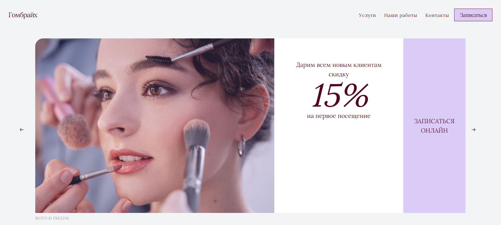
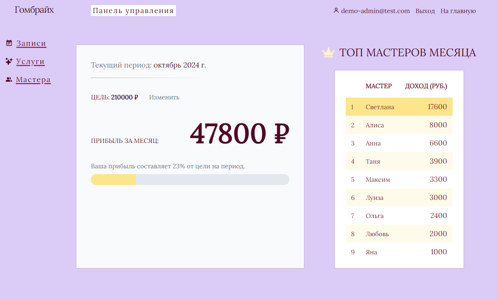

# Салон красоты Гомбрайх (сайт для клиентов + админ-панель на Next.js)

Добро пожаловать на сайт салона красоты [**Гомбрайх**](https://gombreich.ru/), full-stack проект, предоставляющий как клиентам, так и администраторам салона доступ к различной функциональности. Веб-приложение объединяет на одном домене клиентскую часть и админ-панель, взаимосвязанные между собой и с базой данных Postgres.

- **Адрес сайта**: [https://www.gombreich.ru/](https://www.gombreich.ru/)

## Features

### Сайт для клиентов

- Краткая информация о салоне, услугах и акциях, контактные данные и расположение на виджете Google Maps
- Удобная сисема онлайн-записи
- Адаптивная и кроссбраузерная верстка
- Простой, но изящный дизайн, карусели, небольшие анимации, call-to-action кнопки, ведущие к форме для записи

### 👑  Admin Dashboard

- Просмотр и редактирование броней за любой период времени
- Отслеживание доходов и установка целей на период
- Сведения о доходах всех мастеров салона
- Аутентификация, защита базы данных с помощью RLS-policies

## 👩‍🔧  Использованные технологии

- **Frontend**: Next.js, React, TypeScript, Tailwind CSS
- **Backend**: Next.js
- **Database**: PostgreSQL (с использованием Supabase)

### А также:

- **Shadcn UI** для некоторых элементов дизайна (меню для мобильных)
- **AOS (Animate On Scroll)** для создания простых анимаций
- **Embla Carousel** для каруселей
- и другие инструменты

_Идеи и советы по улучшению проекта приветствуются_

### Скриншоты

